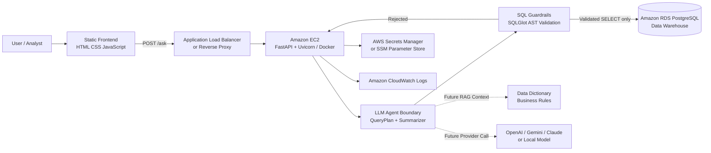

# Agriculture Data Warehouse LLM Agent

ระบบ AI Assistant สำหรับสอบถามข้อมูล Data Warehouse ของสหกรณ์การเกษตรด้วยภาษาธรรมชาติ ผู้ใช้สามารถถามเป็นภาษาไทย เช่น "ยอดขายสุทธิรายเดือนเป็นเท่าไร" หรือ "สินค้าคงคลังปัจจุบันเหลือเท่าไร" แล้วระบบจะแปลงคำถามเป็น SQL แบบ read-only ตรวจสอบด้วย guardrails ก่อน query Amazon RDS และสรุปคำตอบกลับมาให้อ่านง่าย

> สถานะโปรเจกต์: MVP skeleton สำหรับส่งต่อทีม AI Engineer, Backend และ Web Development

## AWS Architecture




### Component Overview

| Layer | AWS / Runtime | หน้าที่ |
|---|---|---|
| Frontend | Static site, S3 + CloudFront หรือ web server บน EC2 | หน้า Chat UI สำหรับส่งคำถามและแสดงคำตอบ, SQL, source และ status |
| API | Amazon EC2 รัน FastAPI ด้วย Uvicorn หรือ Docker | รับ request `/ask`, เรียก workflow, ส่ง response กลับ Frontend |
| Agent Boundary | Python service layer | สร้าง `QueryPlan`, แยกคำถามเชิงความรู้กับคำถามเชิง analytics และเตรียมจุดเชื่อม LLM provider |
| SQL Guardrails | Application deterministic control | parse SQL ด้วย SQLGlot, อนุญาตเฉพาะ SELECT, ตรวจ schema/table/column allowlist, จำกัด row และ timeout |
| Data Warehouse | Amazon RDS PostgreSQL | เก็บ fact/dimension tables สำหรับ harvest, sales, shipment, inventory และ master data |
| Secrets | AWS Secrets Manager หรือ SSM Parameter Store | เก็บ `DATABASE_URL` และ API keys โดยไม่ใส่ credential ใน source code |
| Observability | Amazon CloudWatch | เก็บ application logs, errors, latency และ audit trail ของ query |

## Request Flow

```text
User question
  -> Frontend calls POST /ask
  -> FastAPI validates request
  -> Agent creates QueryPlan
  -> SQL is parsed and validated by guardrails
  -> Valid SELECT is executed by read-only database user
  -> Result rows are summarized
  -> Frontend renders answer, SQL, sources and status
```

LLM ไม่ได้รับสิทธิ์ execute SQL โดยตรง ทุก SQL ต้องผ่าน deterministic guardrails ก่อนเสมอ และ production database ควรใช้ read-only user แยกต่างหาก

## Key Features

- FastAPI backend พร้อม endpoint `/health` และ `/ask`
- Frontend chat prototype ด้วย HTML, CSS และ JavaScript
- Framework-neutral LLM boundary ยังไม่ผูกกับ LangChain หรือ framework ใดเป็นพิเศษ
- Schema catalog สำหรับ fact และ dimension tables
- SQL validation ด้วย SQLGlot AST
- ปฏิเสธ write statement, multi-statement, table/column นอก allowlist และ `SELECT *`
- บังคับ `LIMIT` และ PostgreSQL statement timeout
- Response รองรับ `answered`, `rejected` และ `not_configured`
- เตรียมโครงสำหรับ RAG, LLM provider จริง, audit logging และ production deployment

## Project Structure

```text
Cloud_LLMs/
|-- app/
|   |-- agents/          Query plan, agent state และ LLM boundary
|   |-- api/             FastAPI routes และ request/response models
|   |-- core/            Environment settings
|   |-- db/              RDS connection และ warehouse schema catalog
|   |-- guardrails/      Deterministic SQL validation
|   |-- prompts/         System และ Text-to-SQL prompts
|   |-- services/        Application workflow
|   `-- tools/           SQL และ RAG tools
|-- frontend/
|   |-- index.html       หน้าแชตต้นแบบ
|   |-- styles.css       Responsive UI styles
|   |-- app.js           เรียก Backend API และ render ผลลัพธ์
|   |-- docs/            API contract สำหรับทีม Web Development
|   `-- src/             TypeScript API client และ shared types
|-- dataset/             CSV ตัวอย่างสำหรับ operational และ master data
|-- docs/                Architecture, deployment และ framework evaluation
|-- tests/               SQL guardrail tests
|-- scripts/             Local helper scripts
|-- Dockerfile           Container image สำหรับ backend
|-- requirements.txt     Python runtime dependencies
`-- requirements-dev.txt Development และ test dependencies
```

## Technology Stack

- Backend: Python, FastAPI, Pydantic, SQLAlchemy
- Database: Amazon RDS PostgreSQL
- SQL guardrails: SQLGlot
- Frontend prototype: HTML, CSS, JavaScript
- Deployment target: Amazon EC2, Docker, optional ALB / reverse proxy
- Future LLM providers: OpenAI, Gemini, Claude หรือ local model

## Local Development

### 1. Create Environment

```powershell
python -m venv .venv
.\.venv\Scripts\Activate.ps1
python -m pip install -r requirements.txt
Copy-Item .env.example .env
```

แก้ไข `.env` ให้ตรงกับ environment ที่ใช้ โดยเฉพาะ `DATABASE_URL` และ API key ของ LLM provider เมื่อต่อ provider จริง

### 2. Run Backend

```powershell
uvicorn app.main:app --reload --port 8000
```

ตรวจสอบ service:

- Health check: `http://localhost:8000/health`
- Swagger UI: `http://localhost:8000/docs`
- OpenAPI JSON: `http://localhost:8000/openapi.json`

### 3. Run Frontend

```powershell
python -m http.server 5173 --directory frontend
```

เปิดเว็บที่ `http://localhost:5173`

ค่า default ของ Frontend จะเรียก Backend ที่ `http://localhost:8000` สามารถเปลี่ยนได้จาก meta `api-base-url` ใน `frontend/index.html`

## Environment Variables

| Variable | Example | Description |
|---|---|---|
| `APP_NAME` | `agri-dw-llm-agent` | ชื่อ application |
| `APP_ENV` | `local` | environment เช่น `local`, `staging`, `production` |
| `LOG_LEVEL` | `INFO` | ระดับ log |
| `CORS_ORIGINS` | `http://localhost:3000,http://localhost:5173` | frontend origins ที่เรียก API ได้ |
| `LLM_PROVIDER` | `openai` | provider ที่ต้องการใช้ในอนาคต |
| `LLM_MODEL` | `gpt-4o-mini` | ชื่อโมเดล |
| `OPENAI_API_KEY` | empty | OpenAI credential |
| `GOOGLE_API_KEY` | empty | Gemini credential |
| `ANTHROPIC_API_KEY` | empty | Claude credential |
| `DATABASE_URL` | `postgresql+psycopg://...` | Amazon RDS connection string |
| `DATABASE_SCHEMA` | `data_warehouse` | schema ที่อนุญาตให้ query |
| `MAX_SQL_ROWS` | `100` | จำนวนแถวสูงสุดต่อ query |
| `MAX_SQL_SECONDS` | `15` | query timeout เป็นวินาที |

ห้ามนำ API key หรือ database credentials ไปใส่ใน frontend, Git repository หรือ public environment variables

## API Contract

### `GET /health`

```json
{
  "status": "ok",
  "env": "local"
}
```

### `POST /ask`

Request:

```json
{
  "question": "ยอดขายสุทธิรายเดือนเป็นเท่าไร",
  "user_role": "analyst"
}
```

Response:

```json
{
  "answer": "SQL ผ่าน guardrail แล้ว แต่ยังไม่ได้ตั้งค่า DATABASE_URL",
  "sql": "SELECT ... LIMIT 100",
  "sources": ["schema-catalog"],
  "status": "not_configured",
  "guardrail_violations": []
}
```

| Status | Meaning |
|---|---|
| `answered` | ระบบ query และสรุปคำตอบสำเร็จ |
| `rejected` | SQL ไม่ผ่าน guardrails และไม่ได้เรียก database |
| `not_configured` | ยังไม่ได้ตั้งค่า LLM provider หรือ `DATABASE_URL` |

รายละเอียดเพิ่มเติมอยู่ที่ `frontend/docs/API_CONTRACT.md`

## AWS Deployment Notes

### Recommended EC2 Setup

1. สร้าง EC2 Ubuntu LTS ใน VPC เดียวกับ RDS หรือ subnet ที่ route ถึง RDS ได้
2. ติดตั้ง Docker หรือ Python runtime
3. ตั้งค่า Security Group ให้เปิด inbound เฉพาะ port ที่ต้องใช้ เช่น `80`, `443` หรือ backend port หลัง reverse proxy
4. ปิด public access ของ RDS ถ้าไม่จำเป็น และอนุญาต inbound จาก EC2 Security Group เท่านั้น
5. เก็บ secrets ใน AWS Secrets Manager หรือ SSM Parameter Store
6. ส่ง logs ไป CloudWatch เพื่อใช้ audit และ troubleshoot

### Docker Example

```bash
docker build -t agri-dw-llm-agent .
docker run --env-file .env -p 8000:8000 agri-dw-llm-agent
```

Production สามารถวาง Nginx หรือ Application Load Balancer หน้า EC2 เพื่อทำ HTTPS termination, health check และ routing ไปยัง backend ได้

## Security Checklist

- ใช้ RDS user แบบ read-only สำหรับ agent
- จำกัด RDS Security Group ให้รับ connection จาก EC2 เท่านั้น
- เปิด CORS เฉพาะ frontend domain ที่เชื่อถือได้
- เก็บ `DATABASE_URL` และ LLM API keys ใน Secrets Manager หรือ SSM
- Log question, generated SQL, validation status, latency และ error โดยระวังข้อมูลส่วนบุคคล
- เพิ่ม authentication และ role-based access ก่อนใช้งานจริง
- เพิ่ม rate limit ที่ API Gateway, ALB, Nginx หรือ application middleware
- ทดสอบ guardrails ทุกครั้งก่อนเพิ่ม table หรือ metric ใหม่

## Testing

ติดตั้ง development dependencies:

```powershell
python -m pip install -r requirements-dev.txt
```

รัน test suite:

```powershell
pytest -q
```

Test ปัจจุบันครอบคลุม SQL guardrails เช่น SELECT ที่อนุญาต, write statement, table/column นอก allowlist, `SELECT *`, multi-statement และการบังคับ `LIMIT`

## Roadmap

- เชื่อมต่อ LLM provider จริงและบังคับ structured `QueryPlan`
- ยืนยัน schema catalog กับโครงสร้าง Amazon RDS จริง
- เพิ่ม RAG ingestion สำหรับ data dictionary และ business rules
- เพิ่ม authentication, role-based access และ audit logging
- สร้าง Text-to-SQL evaluation set อย่างน้อย 30-50 คำถาม
- เพิ่ม integration tests กับ staging database
- ย้าย frontend prototype เข้า framework หลักของทีม Web Development

## Related Docs

- `docs/data_warehouse_context.md` - บริบทและ schema ของ Data Warehouse
- `docs/framework_evaluation.md` - การเปรียบเทียบ LLM / agent frameworks
- `docs/llm_scope.md` - ขอบเขตงาน AI Engineer
- `docs/aws_ec2_deploy.md` - แนวทาง deploy บน Amazon EC2
- `frontend/docs/API_CONTRACT.md` - ข้อตกลงระหว่าง Backend และ Frontend
